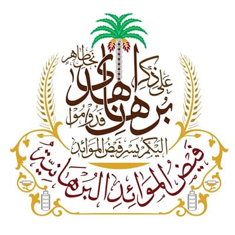
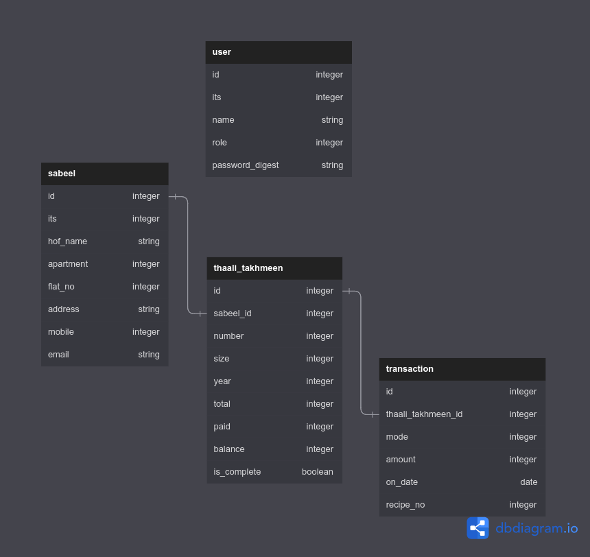

  
  <h2>Faizul Mawaid il Burhaniyah (FMB)</h2>
  
A Dawoodi Bohra NPO with one overarching objective: <strong>to provide at least one wholesome & nutritious meal a day to every community household.</strong>

  <!-- RUBY -->
  

  <!-- RAILS -->
  

  <!-- POSTGRESQL -->
  

  <!-- Bootstrap -->
  

  <!-- REPO VIEWS -->
  
  <!-- WAKATIME -->
  

---

## Table of Contents

-   [About FMB](#about-fmb)
    -   [Definition of FMB](#definition-of-fmb)
-   [About project](#about-the-project)
    -   [Hosting](#hosting)
    -   [Gems](#gems)
    -   [Schema](#schema)
        -   [User](#user-model)
        -   [Sabeel](#Sabeel-model)
        -   [ThaaliTakhmeen](#thaali-takhmeen-model)
        -   [Transaction](#transaction-model)
-   [Testing](#testing)
-   [Bugs](#bugs)
-   [Additional Features](#additional-features)

---

## About FMB

FMB was initiated by the 52nd al-Dai al-Mutlaq Syedna Mohammed Burhanuddin, who often expressed an earnest, but seemingly insurmountable desire: to ensure that no member of the Dawoodi Bohra community anywhere in the world go to bed hungry. Launched in August 2011, this novel initiative today benefits over 135,000 community households in 869 cities across the world.

Apart from permanent staff, over 7,000 Bohra volunteers strive to keep the community kitchens running and ensure that fresh, nutritious meals are delivered on time each and every day. Run with voluntary donations from community members, FMB brings together every member of the community, regardless of socio-economic status. Over the past ten years, FMB has further expanded outside the Bohra community to include numerous sustained efforts to provide food to the hungry and impoverished as well as aid and relief supplies during emergencies and natural calamities.

### Definition of FMB

-   **Faiz** 👉 The original meaning of faiz (or fayd) indicates an effusion or outpouring, such as water gushing from a stream or a glass filled until the liquid overflows. It has come to connote anything that is profuse or in abundance; for example, abundant generosity. In the name Faiz al-Mawaid al-Burhaniyah, faiz is understood as the abundant blessings or bounties that flow from the mawaid of Syedna Mohammed Burhanuddin.

-   **Mawaid** 👉 Mawaid is the plural of maaidat, which refers to a dining platter filled with food, or more specifically, the thaal, the large steel platters around which Dawoodi Bohras traditionally sit and dine.

-   **Burhaniyah** 👉 An adjective that attributes the mawaid to Syedna Mohammed Burhanuddin. For the Dawoodi Bohras, the name Faiz al-Mawaid al-Burhaniyah is a continuing reminder of the blessings and benevolence of Syedna Burhanuddin.

> For further details, please visit this [link](https://www.thedawoodibohras.com/about-the-bohras/faiz-al-mawaid-al-burhaniyah/).

---

## About the project

### Hosting

This application is hosted [here](https://fmb.fly.dev) using [Fly.io](https://fly.io/).

---

### Gems

The completion of the project's tasks necessitated the use of the following gems:

|       **Gem Names**       | **Version** |
| :-----------------------: | :---------: |
|        Postgresql         |  **1.2.3**  |
|          BCrypt           | **3.1.18**  |
|           RSpec           |  **6.0.1**  |
|        Factory Bot        |  **6.2.0**  |
|         Capybara          | **3.38.0**  |
|    Rack Session Access    |  **0.2.0**  |
|     Shoulda-Matchers      |  **5.3.0**  |
| Shoulda-Callback-Matchers |  **1.1.4**  |
| Rails Controller Testing  |  **1.0.5**  |
| Validates Email Format of |  **1.7.2**  |
|           Faker           |  **3.1.0**  |
|        FriendlyId         |  **5.5.0**  |
|        Simple Form        |  **5.1.0**  |
|          Ransack          |  **3.2.1**  |
|         Humanize          |  **2.5.0**  |
|           Pagy            |  **6.0.0**  |
|    Selenium Webdriver     |  **4.7.0**  |
|           Prawn           |  **2.4.0**  |
|        Prawn Table        |  **0.2.2**  |
|          Matrix           |  **0.4.2**  |

---

### Schema

#### User Model

-   The User model will hold data of the members in the FMB organization of a particular city.

-   A user has to sign-in in order to access the site with the credentials provided by the `admin`.

-   A user can have 3 different roles such as `admin`, `member` & `viewer`.
    -   An `admin` has access to everything and also the ability to create & delete `sabeel` & `user` with any roles which no other `role` has access to.
    -   A `member` has access to create, update or delete routes of `thaali_takhmeen` of a `sabeel` & `transaction` of a `thaali_takhmeen`.
    -   A `viewer` has NO access to create, update or delete routes of any models but only view the site and all its data.

> The first `admin`/`user` can oly be created by the developer and then later that `admin` can create any number of users with roles of his choosing.

#### Sabeel Model

-   **A Dawoodi Bohra family in other words is called a `sabeel`.**
-   All the sabeels listed in this model will only belong to a particular city.
-   The `ITS` attribute is an 8-digit number which is unique for all Dawoodi Bohra members. The sabeel is created with the `ITS` number of HOF member.

#### Thaali Takhmeen Model

-   **The term `Thaali` refers to a lunch/dinner set that is used to give meal to a sabeel.**
-   A `sabeel` can only take a `thaali` for each `year` & have multiple thaalis over the years.
-   The value of `number` attribute will be unique for each `year`, so no 2 `thaalis` can have same number in the same `year`.
-   A `sabeel` can choose a `thaali` of the size required (`small`, `medium` & `large`) to avoid food wastage.
-   **The term `takhmeen` refers to the voluntary donations done by each `sabeel` for a `thaali`.**
-   The `total`, `paid` & `balance` attributes belong to `takhmeen` which basically keeps track of donation amount.
-   The value of the `year` attribute depends on the value of the global variable `$active_takhmeen`. The user cannot change it and it will be automatically set by the developer.

#### Transaction model

-   A `takhmeen` can have many `transaction`.
-   After creating or updating a transaction, the value of `balance` & `paid` attribute of parent instance is updated accordingly.
-   The `recipe_no` will be unique for all transactions.
-   A `transaction` can be of any of these 3 `mode`: `cash`, `bank` or `cheque`.

---

## Testing

The development of this application utilizes TDD approach. By writing tests first and then writing the code, the development process becomes more focused and streamlined. It also helps catch bugs and other issues early on in the development process, which can save time and resources in the long run and can help ensure that the application is of high quality and works as intended.

**As of Release Version 1.0.0, this application consisted of 495 test suites testing every single routes, requests, models & views.**

-   🎥 [Routes](https://youtu.be/9wv6zdohgsA) _(78 examples)_
-   🎥 [Requests](https://youtu.be/e86BCc_Lcvo) _(116 examples)_
-   🎥 [Models](https://youtu.be/Dks5DcOswNE) _(103 examples)_
-   🎥 [Features](https://youtu.be/ZZ51DW0-SEs) _(198 examples)_

---

## Bugs

-   Loading additional content with hotwire don't work if '**%>**' text is removed from the `app/views/shared/_results.html.erb` file.
-   Generate SQL query for inactive sabeels.
-   '**Back**' button doesn't redirect to last visited page after user clicks on an un-authorized link.
-   Let `admin` have access the ability to change the _current-year_ value for takhmeen.

---

## Additional Features

-   Fill in the Takhmeen form (PDF) after creating new takhmeen.
-   Send transaction receipt (PDF) to sabeels email address after its new transaction is created.
